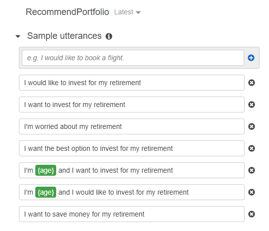
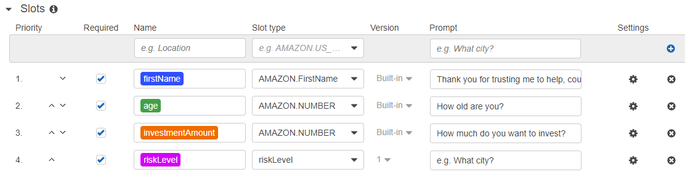
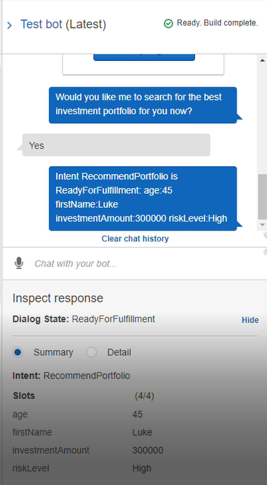
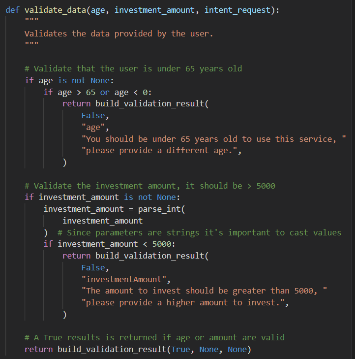
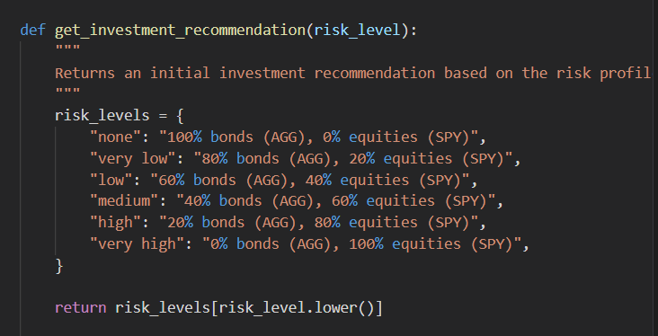
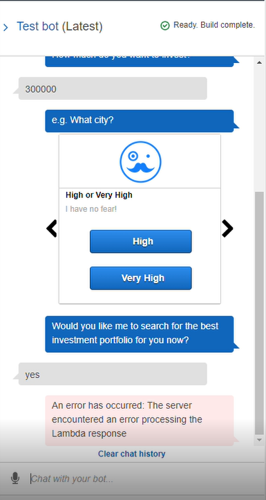

# unit13-challenge
## The Power of the Cloud and Unsupervised Learning
### Option 1: Robo Advisor for Retirement Plans

### Initial Robo Advisor Configuration:
___ 
## Utterances

## Slots

### Build and Test the Robo Advisor (No Lambda)

## Enhance the Robo Advisor with an Amazon Lambda Function
### User Input Validation

### Investment Portfolio Recommendation

# Robo Advisor with Lambda

---
***In Summary:*** I had a lot of enjoyment in doing this challenge but, however, it was much to my frustration and disappointment that the final step in this RoboAdvisor did not process.  Everything works perfectly until this step and I know it is something in the code that after many hours of deliberation I just cannot work out.  I did use resources in Alan and Chris (group tutor) but to no avail. 

Also, I appologise, but was unable to get the video (mp4) file to work in the README file.  It is in the repository...
